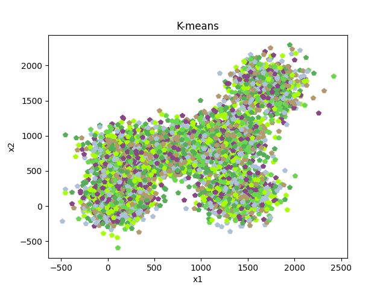

<h1>K-Means Tool</h1>
This is a tool developed to be used as a 
graphical resource for educational purposes,
enabling the visualization of each step taken
during the execution of the k-means clustering
algorithm.


<h2>Data file format</h2>
the function <strong>readData()</strong> expects
a simple file containing a list of 2-dimensional
points, one point per line and each coordinate 
separated by a blank space.

<h2>K-means</h2>
the file <strong>kmeans.py</strong> is 
executable and accept some arguments shown as follows.
<ul>
    <li>-f : input filename</li>
    <li>-k : number of clusters</li>
    <li>-i : max iterations</li>
    <li>-o : output filename</li>
</ul>

execution example:
```
python kmeans.py -k 3 -f 'datasets/data.dat'
```

the result of executing the commandline is shown
below.

The red dots represent each centroid calculated
in each iteration of the algorithm, while every
other color represents one of the k classes. 


<h2>Gif Generation</h2>
the code in <strong>gifGenerator.py</strong> 
takes a snapshot of the data in each of the 
iterations of the k-means process.

the <strong>gifGenerator.py</strong> file can 
receive some arguments as described below.

<ul>
    <li>-f : input filename</li>
    <li>-k : number of clusters</li>
    <li>-i : max iterations</li>
    <li>-o : output filename</li>
    <li>-s : gif frames per second</li>
</ul>

execution example:
```
python gifGenerator.py -k 6 -s 1 -f datasets/data2.dat

```

the .gif output produced after running this command 
line can be seen below.



